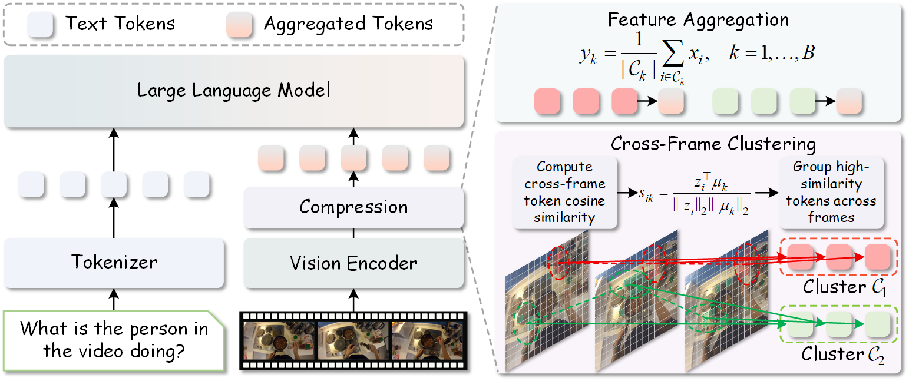

<div align="center">

# Rethinking Visual Token Compression for Video Large Language Models: A Simple Yet Strong Baseline

<a href="https://scholar.google.com/citations?user=yYi80ToAAAAJ&hl=en">Xiao Zhang</a><sup>1,2</sup>&emsp;
<a href="https://scholar.google.com/citations?user=u_RNsOUAAAAJ&hl=en">Wang Zeng</a><sup>2</sup>&emsp;
<a href="https://scholar.google.com/citations?user=wrNd--oAAAAJ&hl=en">Sheng Jin</a><sup>2</sup>&emsp;
<a href="https://scholar.google.com/citations?user=KZn9NWEAAAAJ&hl=en">Wentao Liu</a><sup>2</sup>&emsp;
<a href="https://scholar.google.com/citations?user=AerkT0YAAAAJ&hl=en">Chen Qian</a><sup>2</sup>&emsp;
<a href="https://scholar.google.com/citations?user=iFp1FOMAAAAJ&hl=en">Shichao Kan</a><sup>1</sup>

<sup>1</sup>Central South University&emsp;
<sup>2</sup>SenseTime Research and Tetras.AI

</div>

### Overview
**SimpleCluster** is a simple, training-free visual token compression baseline for Video LLMs. It performs position-aware cross-frame clustering in the visual feature space and represents each cluster using the mean of its original visual features. Despite its simplicity, it **matches or surpasses** published video token compression methods.



<a href="https://arxiv.org/abs/2609.35394"></a>

## 🚀 News

**[2026/09]** Code and evaluation scripts are open-sourced.

**[2026/09]** SimpleCluster paper is released.

## 🛠️ Installation

### Clone the repository

```shell
git clone https://github.com/xiaozhang79/SimpleCluster
cd SimpleCluster
```

### Install dependencies

```shell
conda create -n simplecluster python=3.10 -y
conda activate simplecluster
pip install --upgrade pip
pip install --no-build-isolation -r requirements.txt
```

## 📊 Evaluation

We use [lmms-eval](https://github.com/EvolvingLMMs-Lab/lmms-eval) for evaluation. Scripts are provided under `scripts/`.

### LLaVA-OneVision

```shell
bash scripts/eval_llava_onevision.sh
```

### LLaVA-Video

```shell
bash scripts/eval_llava_video.sh
```

### InternVL3

```shell
bash scripts/eval_internvl3.sh
```

## 💬 Contact

If you have any questions about the paper, codebase, or experimental setup, please feel free to contact [xiaozhang0479@gmail.com](mailto:xiaozhang0479@gmail.com).

## 🙏 Acknowledgement

This work is built upon [lmms-eval](https://github.com/EvolvingLMMs-Lab/lmms-eval), [LLaVA-NeXT](https://github.com/LLaVA-VL/LLaVA-NeXT). We thank them for their excellent works.

## 📢 Citation

If you find this work useful, please consider citing our paper:

```bibtex
@article{zhang2026rethinking,
  title={Rethinking Visual Token Compression for Video Large Language Models: A Simple Yet Strong Baseline},
  author={Zhang, Xiao and Zeng, Wang and Jin, Sheng and Liu, Wentao and Qian, Chen and Kan, Shichao},
  journal={arXiv preprint arXiv:2609.35394},
  year={2026}
}
```
